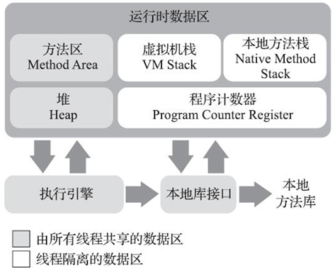
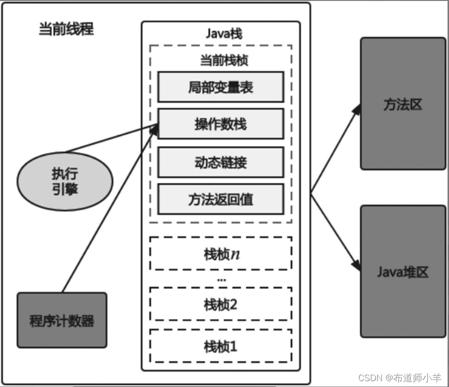
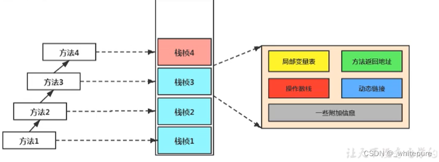
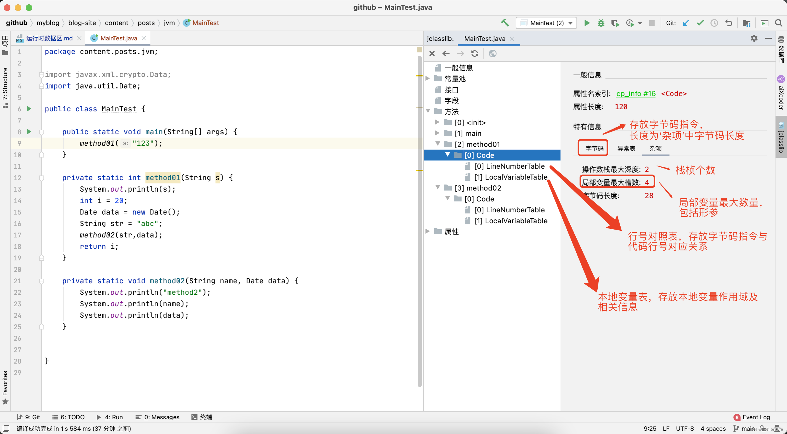
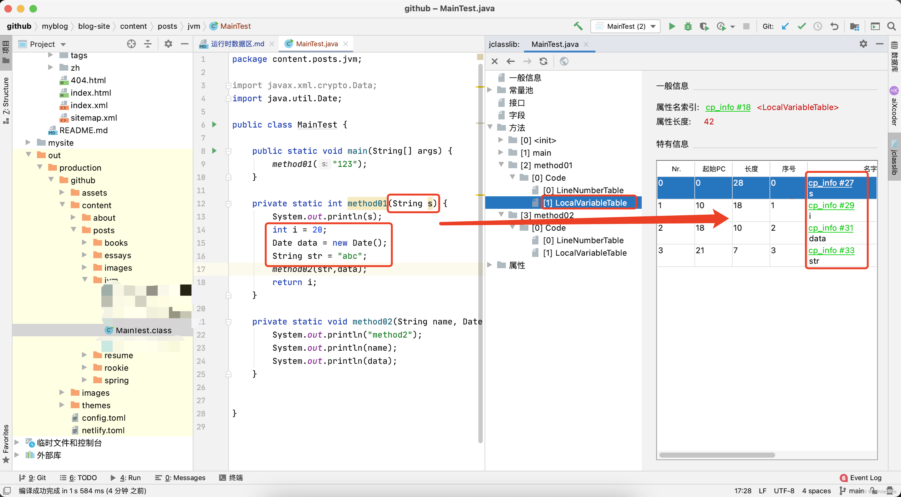
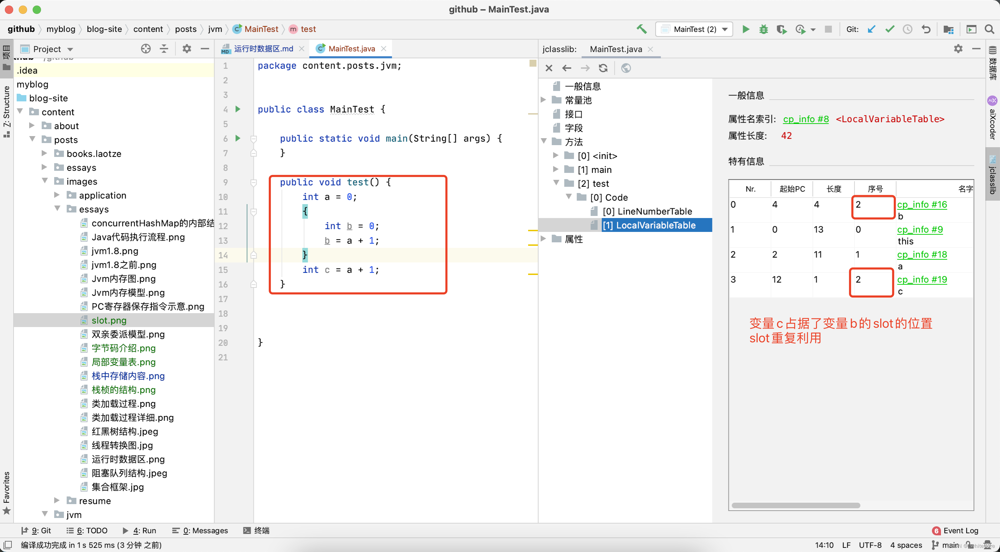
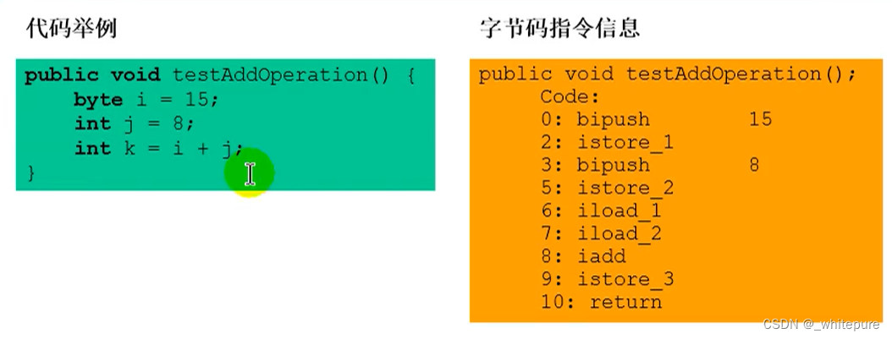
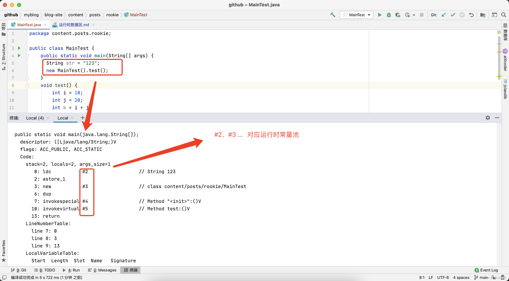
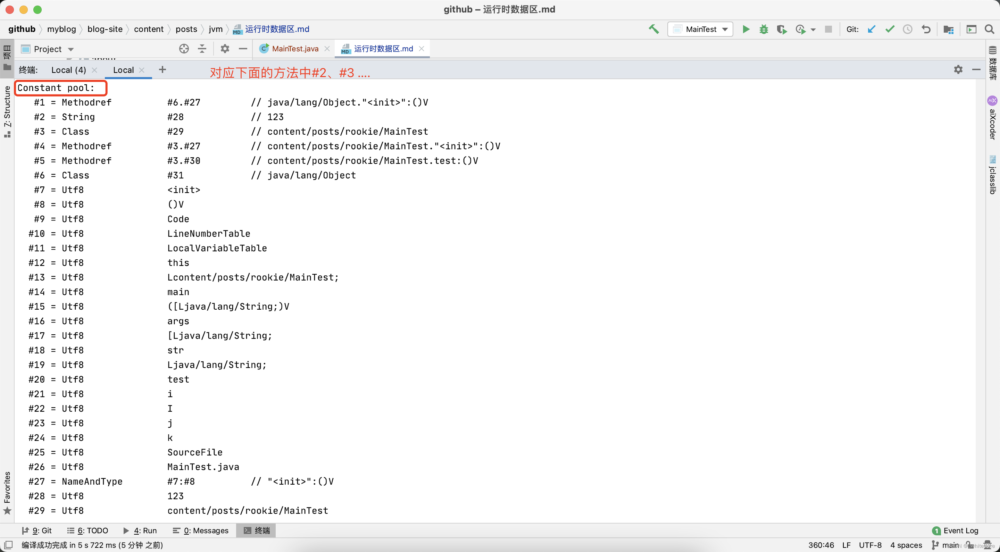
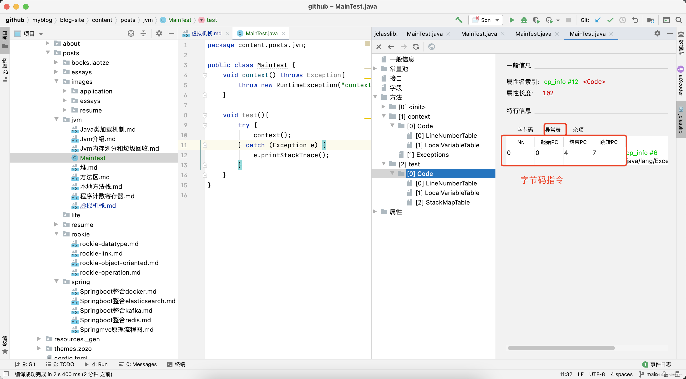

# 概述

::: tip 概述

Java与C++之间有一堵由内存动态分配和垃圾收集技术所围成的高墙，墙外面的想进去，墙里面的人却想出来。

:::

## 2.2 运行时数据区域

### 2.2.1 程序计数器

::: warning 唯一一个在《Java虚拟机规范》中没有规定任何OutOfMemmoryError情况的区域

:::

是一块较小的内存空间，可以看成是==当前线程所执行的字节码的行号指示器==。在Java虚拟机的概念模型里，字节码解释器工作时就是痛过改变这个计数器的值来选取下一条需要执行的字节码指令。

由于Java虚拟机的多线程是通过程序轮流切换、分配处理器执行时间的方式来实现的，在任何一个确定的时刻，一个处理器（对于多核处理器来说是一个内核）都只会执行一条线程中的指令。因此每条线程都需要一个独立的程序计数器。

::: info 注意

- 如果程序正在执行的是一个==Java方法==，这个计数器记录的是正在执行的==虚拟机字节码指令的地址==
- 如果是==本地（Native）方法==，那么计数器==值为空（Undefined）==

:::

程序计数器是一块很小的内存空间，几乎可以忽略不计。它也是运行速度最快的存储区域。在JVM规范中，每个线程都有它自己的程序计数器，是线程私有的，生命周期与线程的生命周期保持一致。

### 2.2.2 Java虚拟机栈

与程序计数器一样，也是线程私有的，它的生命周期与线程相同。虚拟机栈描述的是Java方法执行的线程内存模型：每个方法被执行的时候，Java虚拟机都会同步创建一个栈帧（Stack Frame）用于存储==局部变量表、操作数栈、动态连接、方法出口==等信息。

每个栈帧中存储着：

- 局部变量表
- 操作数栈（或表达式栈）
- 动态链接（或指向运行时常量池的方法引用）
- 方法返回地址（或方法正常退出或者异常退出的定义）
- 一些附加信息

每个线程下的栈都是私有的，因此每个线程都有自己各自的栈，并且每个栈里面都有很多栈帧，栈帧的大小主要由局部变量表和操作数栈决定的。

#### 2.2.2.1局部变量表

局部变量表：Local Variables，被称之为局部变量数组或本地变量表。定义为一个数字数组，主要用于存储方法参数和定义在方法体内的局部变量这些数据类型包括==各类基本数据类型、对象引用（reference），以及returnAddress类型（指向了一条字节码指令的地址）==。

局部变量表所需的容量大小是在编译期确定下来的，并保存在方法的Code属性的`maximum local variables`数据项中。在方法运行期间是不会改变局部变量表的大小的。

方法嵌套调用的次数由栈的大小决定。一般来说，栈越大，方法嵌套调用次数越多。对一个函数而言，它的参数和局部变量越多，使得局部变量表膨胀，它的栈帧就越大，以满足方法调用所需传递的信息增大的需求。进而函数调用就会占用更多的栈空间，导致其嵌套调用次数就会减少。

局部变量表中的变量只在当前方法调用中有效。在方法执行时，虚拟机通过使用局部变量表完成参数值到参数变量列表的传递过程。当方法调用结束后，随着方法栈帧的销毁，局部变量表也会随之销毁。局部变量表，最基本的存储单元是==Slot==（变量槽）局部变量表中存放编译期可知的各种基本数据类型（8种），引用类型（reference），returnAddress类型的变量。

在局部变量表里，32位以内的类型只占用一个slot，64位的类型（long和double）占用两个slot。栈帧中的局部变量表中的槽位是可以重用的，如果一个局部变量过了其作用域，那么在其作用域之后申明的新的局部变就很有可能会复用过期局部变量的槽位，从而达到节省资源的目的。

#### 2.2.2.2操作数栈

每一个独立的栈帧除了包含局部变量表以外，还包含一个后进先出的操作数栈，也可以称之为表达式栈。栈为抽象数据结构，不是真实存在的。一般可以用数组或者链表来实现。

操作数栈，主要用于保存计算过程的中间结果，同时作为计算过程中变量临时的存储空间。操作数栈就是JVM执行引擎的一个工作区，当一个方法刚开始执行的时候，一个新的栈帧也会随之被创建出来，这个方法的操作数栈是空的。

每一个操作数栈都会拥有一个明确的栈深度用于存储数值，其所需的最大深度在编译期就定义好了，保存在方法的Code属性中，为maxstack的值。栈中的任何一个元素都可以是任意的Java数据类型：

- 32bit的类型占用一个栈单位深度
- 64bit的类型占用两个栈单位深度

操作数栈并非采用访问索引的方式来进行数据访问的，而是只能通过标准的入栈和出栈操作来完成一次数据访问。如果被调用的方法带有返回值的话，其返回值将会被压入当前栈帧的操作数栈中，并更新PC寄存器中下一条需要执行的字节码指令。

操作数栈中元素的数据类型必须与字节码指令的序列严格匹配，这由编译器在编译器期间进行验证，同时在类加载过程中的类检验阶段的数据流分析阶段要再次验证。另外，我们说Java虚拟机的解释引擎是基于栈的执行引擎，其中的栈指的就是操作数栈。

#### 2.2.2.3 动态链接

每一个栈帧内部都包含一个指向运行时常量池中该栈帧所属方法的引用，包含这个引用的目的就是为了支持当前方法的代码能够实现动态链接（Dynamic Linking）。比如：invokedynamic指令。

在Java源文件被编译到字节码文件中时，所有的变量和方法引用都作为符号引用（symbolic Reference）保存在class文件的常量池里。比如：描述一个方法调用了另外的其他方法时，就是通过常量池中指向方法的符号引用来表示的。那么==动态链接的作用，就是为了将这些符号引用转换为调用方法的直接引用==。

#### 2.2.2.4 方法返回值

存放==调用该方法的PC寄存器的值==，当一个方法开始执行后，只有两种方式可以退出：

- 正常执行完成；
- 出现未处理的异常，非正常退出；

无论通过哪种方式退出，在方法退出后都返回到该方法被调用的位置，栈帧被弹出。方法正常退出时，调用者的PC计数器的值作为返回地址，即调用该方法的指令的下一条指令的地址。而通过异常退出的，返回地址是要通过异常表来确定，栈帧中一般不会保存这部分信息。也就是说，栈帧随着方法调用而创建，随着方法结束而销毁。无论方法正常完成还是异常完成都算作方法结束。

执行引擎遇到任意一个方法返回的字节码指令（return），会有返回值传递给上层的方法调用者，简称正常完成出口。在方法执行过程中遇到异常（Exception），并且这个异常没有在方法内进行处理，也就是只要在本方法的异常表中没有搜索到匹配的异常处理器，就会导致方法退出，简称异常完成出口。一个方法在正常调用完成之后，究竟需要使用哪一个返回指令，还需要根据方法返回值的实际数据类型而定。

在字节码指令中，返回指令包含ireturn（当返回值是boolean，byte，char，short和int类型时使用），lreturn（Long类型），freturn（Float类型），dreturn（Double类型），areturn。另外还有一个return指令声明为void的方法，实例初始化方法，类和接口的初始化方法使用。

方法执行过程中，抛出异常时的异常处理，存储在一个异常处理表，方便在发生异常的时候找到处理异常的代码。
 

本质上方法的退出就是当前栈帧出栈的过程。此时，需要恢复上层方法的局部变量表、操作数栈、将返回值压入调用者栈帧的操作数栈、设置PC寄存器值等，让调用者方法继续执行下去。正常完成出口和异常完成出口的区别在于，通过异常完成出口退出的不会给他的上层调用者产生任何的返回值。

##### 2.2.2.5一些附加信息

栈帧中还允许携带与Java虚拟机实现相关的一些附加信息。例如，对程序调试提供支持的信息。
